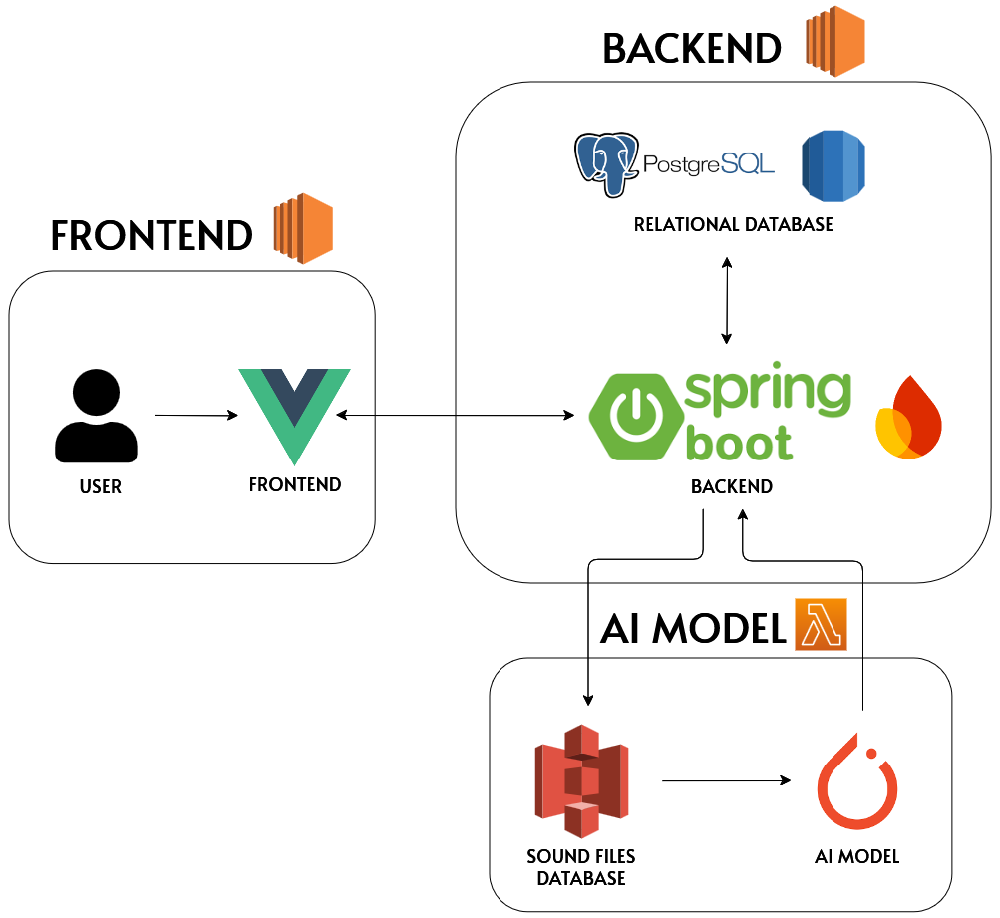

# 📢 ZIGGS - Anomaly Detection at Home Based on Sound Systems

## 📝 Proposal

In today's world, ensuring safety at home requires more than traditional surveillance. **ZIGGS** introduces an audio-based anomaly detection system that monitors environmental sounds in real-time. Leveraging machine learning and LG’s IoT devices, this system can detect unusual sounds, such as distress calls, loud noises, or periods of silence that could indicate emergencies. It tailors responses to individual household environments, providing a personalized safety net.

### Key Use Cases
- **Elderly care** - Alerts for unusual sounds indicating potential health emergencies.
- **Child monitoring** - Detection of concerning noises or extended silences.
- **Pet monitoring** - Notifications for pet disturbances or accidents.

## 🚨 Problem Statement

Traditional home monitoring systems lack effective audio detection capabilities, often missing critical events or generating false alarms. **ZIGGS** addresses this by combining IoT devices and machine learning to monitor sounds, adapting over time to each home’s unique acoustic environment for accurate alerts.

## 💻 Architecture Overview

## 👥 Team Members

| Name               | Dept.                       | E-mail                         | Role                  |
|--------------------|-----------------------------|--------------------------------|-----------------------|
| Jan Imhof          | Computer Science Dep.       | uwxdb@student.kit.edu          | AI Developer          |
| Ivan Milosavljevic | Computer Science Dep.       | ivmi61663@eleve.isep.fr        | Back-End Developer    |
| Nicolas Busquet    | Computer Science Dep.       | nrb.busquet@gmail.com          | Front-End Developer   |
| Adrian Samuel      | Computer Science Dep.       | aobermuhlner@gmail.com         | Front-End Developer   |

## 📂 Documentation 

- [Document](https://github.com/Hanyang-Software-Project/Documentation/blob/main/Ziggs-Software-Engineering-Project.pdf)
- [Presentation PPT](https://github.com/Hanyang-Software-Project/Documentation/blob/main/Ziggs_presentation.pdf)
